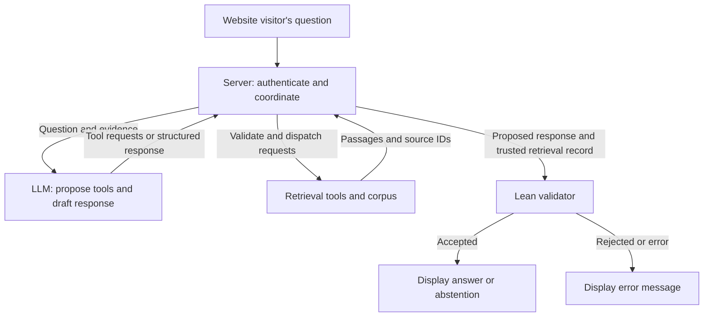

```mermaid
flowchart TD
    Visitor["Website visitor's question"] --> Server["Server: authenticate and coordinate"]
    Server -->|"Question and evidence"| Model["LLM: propose tools and draft response"]
    Model -->|"Tool requests or structured response"| Server
    Server -->|"Validate and dispatch requests"| Retrieval["Retrieval tools and corpus"]
    Retrieval -->|"Passages and source IDs"| Server
    Server -->|"Proposed response and trusted retrieval record"| Validator["Lean validator"]
    Validator -->|"Accepted"| Answer["Display answer or abstention"]
    Validator -->|"Rejected or error"| Fallback["Display error message"]
```